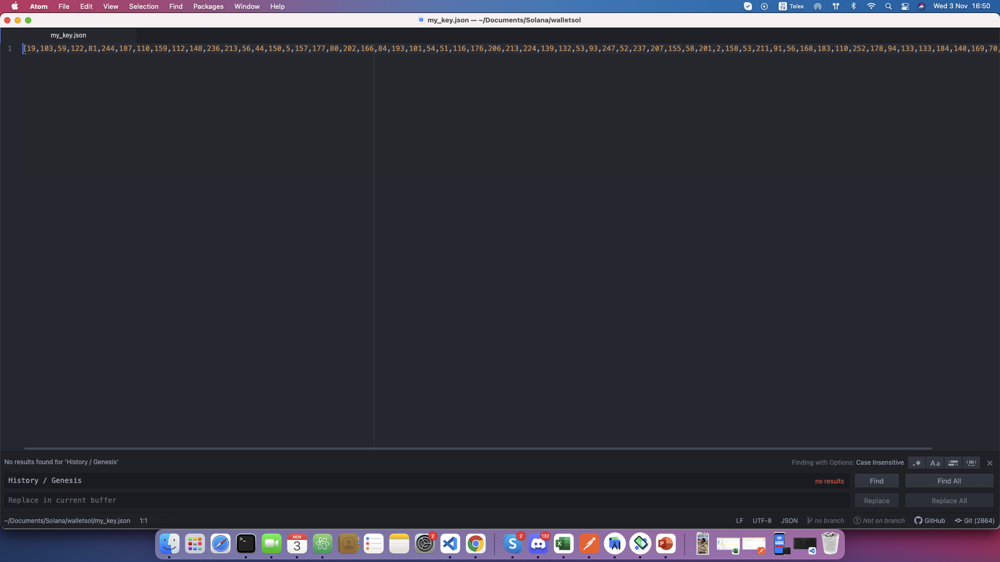
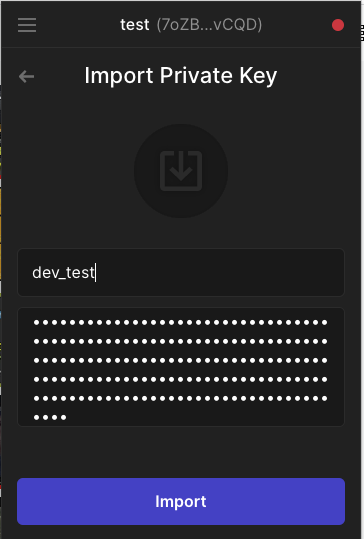
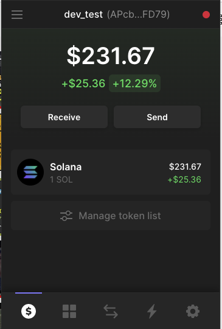
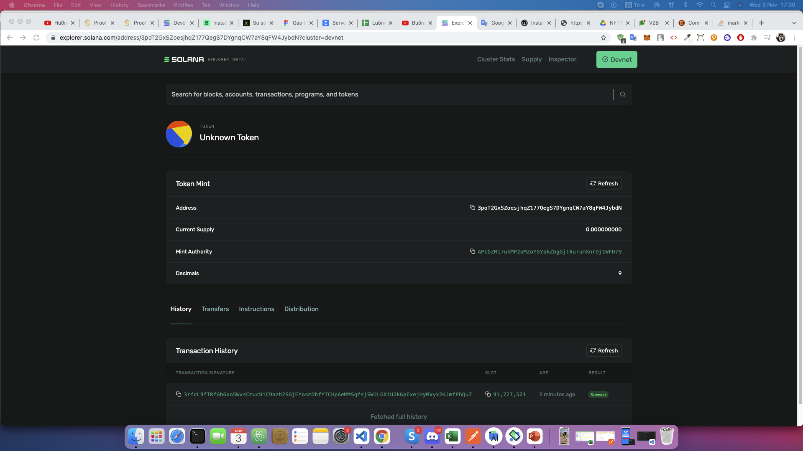

###
Create Token on Solana
### I.Setup environment
Install Rust
```
curl --proto '=https' --tlsv1.2 -sSf https://sh.rustup.rs | sh
```
Install Solana tool

```
sh -c "$(curl -sSfL https://release.solana.com/v1.8.2/install)"

```
Depending on your system, the end of the installer messaging may prompt you to

Export PATH Solana
```
export PATH="/Users/healer/.local/share/solana/install/active_release/bin:$PATH"
```
If you get the above message, copy and paste the recommended command below it to update PATH
Confirm you have the desired version of solana installed by running:

```
solana --version
```

Install Phantom extention on the chrome.

## Markdown
Setup dev net

Run get config
```
solana config get
```

Check line RPC URL. if it don't have to devnet. Please config to devnet. 

Run config devnet for solana
```
solana config set --url https://api.devnet.solana.com
```
Run get config again
```
solana config get
```

output of Config
Run get config again
```
Config File: /Users/healer/.config/solana/cli/config.yml
RPC URL: https://api.devnet.solana.com 
WebSocket URL: wss://api.devnet.solana.com/ (computed)
Keypair Path: devnet/my-keypair.json 
```

Go to Desktop -> create folder WalletSol by run cmd
```
mkdir WalletSolana
```

and cd to WalletSolana
run cmd create key for solana project

```
solana-keygen new --outfile WalletSolana/my_key.json
```

Note*:BIP39 Passphrase (empty for none):  enter Enter keyboard

Out of create key

```
Wrote new keypair to my_key.json
===========================================================================
pubkey: APcbZMi7ukMP2oMZoYSYpkZbgGjTAurumXnrDj1WFD79
===========================================================================
```
you can check balance on dev of key

```
solana balance APcbZMi7ukMP2oMZoYSYpkZbgGjTAurumXnrDj1WFD79 --url https://api.devnet.solana.com 
```
It will show 0 SOL. Because, default when create Sol is 0 SOL. 

Now, airdrop balance

```
solana airdrop 1 APcbZMi7ukMP2oMZoYSYpkZbgGjTAurumXnrDj1WFD79 --url https://api.devnet.solana.com
```
balance of key is 1 SOL

You can check on 

https://explorer.solana.com/

please choose "devnet" for check address

================================================================================================

add wallet address to phantom extention

- Open my-key.json on folder WalletSolana.



Import wallet




Wallet UI



1 SOl = ~~ 231$

NOW, Create token on Solana

run 
```
solana config get
```

if keypair not correct. please set config for it.

```
 solana config set --keypair Documents/Solana/walletsol/my_key.json
```


Create Token
```
spl-token create-token
```

output of cmd

```
Creating token 3poT2GxSZoesjhqZ177QegS7DYgnqCW7aY8qFW4JybdN

Signature: 3rfcL9fTRfGb6oo5WvsCmucBiC9azh2SGjEYosmDhfYTCHpAeMMSqfsjSWJLGXiU2k6pExejHyMVyx2KJmfPhQuZ
```

that is smartcontract addresses

Smart Contract address


Create Suply.


```
spl-token create-account 3poT2GxSZoesjhqZ177QegS7DYgnqCW7aY8qFW4JybdN
```

mint balanace to smart contractr

```
spl-token mint 6gYTX8XqMtshhGY6Us4dxszB9TDxVBg5ePiV75kLE1tW 1000
```

Check smart contract on explorer

//

only mint 100k token
spl-token authorize 3poT2GxSZoesjhqZ177QegS7DYgnqCW7aY8qFW4JybdN mint --disable
